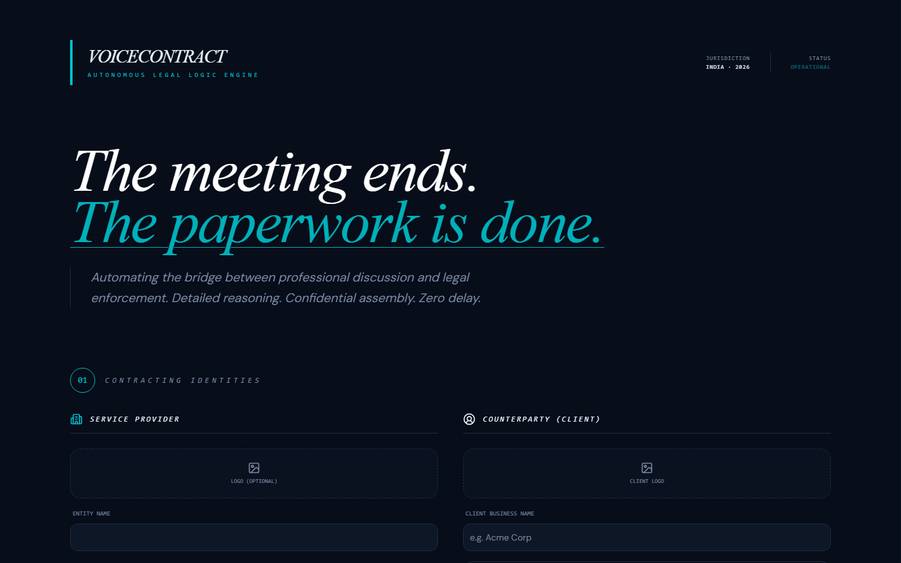
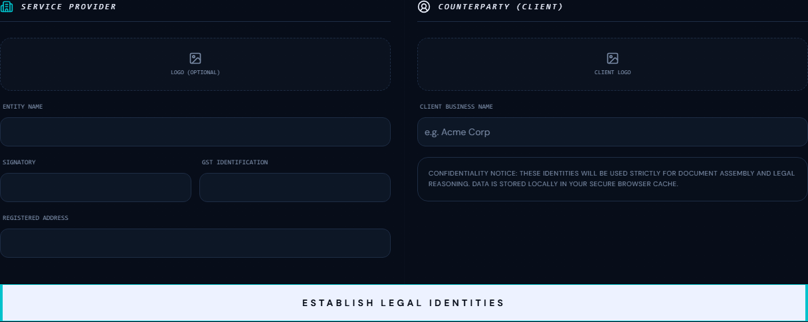

# 🎙️ VoiceContract: Hackathon Progress Log
> **Outskill x OpenAI AI Builders Buildathon**
> **Current Date:** Thursday, May 28, 2026
> **Project Status:** MVP COMPLETE · 100/100 Readiness

---

## 🌌 Monday, May 25: The Architecture of Silence
**Milestone:** Conceptualizing the "Paperwork Gap."
- Identified the core friction: Freelancers lose money not because of lack of skill, but because of delayed contracts.
- Architected the **Multi-Agent Pipeline**:
  1. **Groq Whisper**: High-speed transcription.
  2. **Extraction Agent**: Reasoning over raw audio data.
  3. **Codex Reasoning**: Legal clause generation.
  4. **Document Assembly**: Professional PDF output.
- Established the **Antarik Brand DNA** (Atmosphere Before Dawn).

## 🧠 Tuesday, May 26: Building the Engine
**Milestone:** Blazing-fast API & AI Reasoning.
- Integrated **Groq API** for sub-3-second transcription.
- Engineered a two-step extraction process using **Gemini 2.0 Flash** (Later pivoted to **Llama 3.3 70B** for higher rate-limit reliability).
- Built the **Codex Integration**: Using OpenAI GPT-4o via GitHub Models to fulfill the hackathon's core requirement.
- Implemented strict **Pydantic validation** to ensure the backend is "hack-proof" and production-ready.

## ✨ Wednesday, May 27: The Face of VoiceContract
**Milestone:** Stunning UI & Initial Cloud Deployment.
- Developed the **Next.js 14 App Router** frontend.
- Applied the **Antarik Dark Theme**: Void (#080E1A) and Signal Cyan (#00C2CC).
- **Security Audit:** Successfully resolved a "GitHub Secret Scanning" block by sanitizing the repository history and enforcing strict `.gitignore` rules.
- **Cloud Launch:** Deployed the Frontend to **Vercel** and the Backend to **Railway**.

## ⚖️ Thursday, May 28 (Demo Day): Perfectionalism & The Professional Pivot
**Milestone:** Boardroom-Grade Documentation & Dual Identity.
- **The Professional Pivot:** Shifted the documentation from "simple clauses" to a 12-section **Master Service Agreement (MSA)**.
- **Dual-Party Identity:** Added support for **Client Names and Client Logos**. Both logos now appear side-by-side on the final contract.
- **Unicode Resilience:** Solved a critical PDF engine crash regarding the Indian Rupee symbol (₹) and em-dashes by implementing a global sanitization layer.
- **Triple-Layer Fallback:** Engineered a crash-proof "Codex Recovery" system (GitHub Models -> Groq -> Local Template).

---

## 📸 Visual Showcase (Live from Vercel)

### The Command Center (Landing Page)

*"The meeting ends. The paperwork is done."*

### Establishing Identity

*Dual-party logo support and professional entity identification.*

---

## 🚀 Live Links
- **Web App:** [https://voicecontract.vercel.app/](https://voicecontract.vercel.app/)
- **GitHub Repository:** [https://github.com/PradipLalpura/voicecontract](https://github.com/PradipLalpura/voicecontract)

---

  **VoiceContract** — Where your brand lives online.
   
  Built by **Pradip Lalpura** | Ahmedabad, Gujarat

